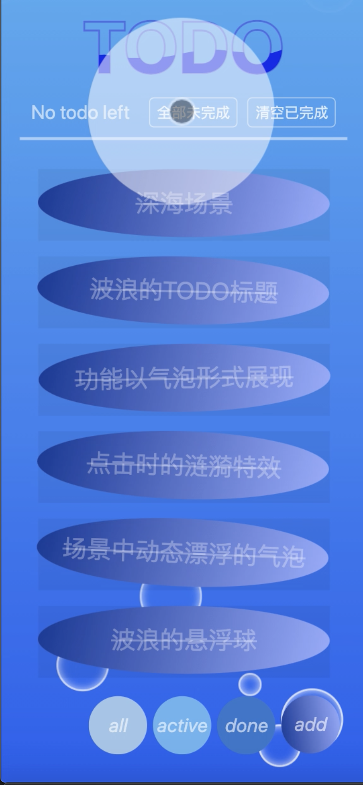
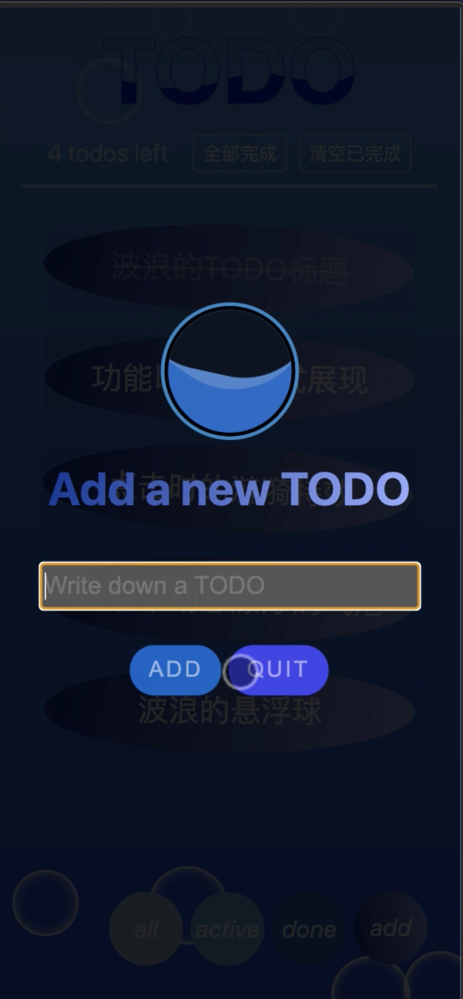
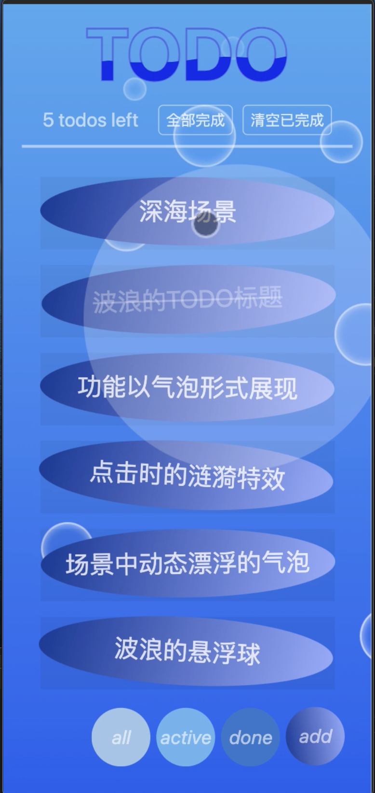

# TodoMVC

[Ying Peng's TodoMVC](http://server.doublez.site:5000/TodoMVC)

[github仓库](https://github.com/doubleZ0108/TodoMVC)


<p align="right">1853287 彭颖</p>

------

* [背景介绍](#背景介绍)
* [功能介绍](#功能介绍)
* [功能展示](#功能展示)
* [核心实现](#核心实现)
   * [刷新后保持——数据持久化](#刷新后保持——数据持久化)
   * [MVC架构——Model](#MVC架构——Model)
   * [事件监听](#事件监听)
      * [手机端模拟double touch](#手机端模拟double-touch)
      * [手机端模拟long touch](#手机端模拟long-touch)
      * [左滑/右滑判定](#左滑/右滑判定)
   * [气泡Todo](#气泡todo)
   * [打造深海场景](#打造深海场景)
      * [点击时的涟漪](#点击时的涟漪)
      * [漂浮的气泡](#漂浮的气泡)
      * [动态波浪文字](#动态波浪文字)
   * [气泡浮动球功能按钮](#气泡浮动球功能按钮)
      * [拖动气泡浮动球](#拖动气泡浮动球)
* [开发环境](#开发环境)
* [关于作者](#关于作者)
* [项目结构](#项目结构)

------

## 背景介绍

本项目开发和实现了一个手机版的网页TodoMVC项目，并在完成基础功能的基础上，实现了一定的附加功能和友好美观的交互设计。项目的实现过程中参考了以下开源项目的思路和结构，以期设计出更简洁和完善的项目。

1.	[TodoMVC](http://todomvc.com/)：这是一个开源项目，实现了一个 Todo Application，广泛用于 `MV*` 框架的选择。

2.	[doubleZ0108/TodoMVC](https://github.com/doubleZ0108/TodoMVC): TodoMVC示例。

## 功能介绍

**基础功能**

- 新增todo
- 删除todo
- 展示todo列表
- 全部完成/未完成
- 删除已完成
- 保存页面状态，刷新页面后可恢复

**高级功能**

- 提供三种条件过滤todo列表 (All / Active / Finished)
- 双击可编辑todo列表中已创建的单条todo

**创意交互和其他功能**

- 深海场景：本项目在基础和高级功能得以实现的基础上，提供了优美简洁的交互设计，以深海作为场景：todo list中的元素和过滤按钮均以气泡的形式展现；同时页面中有一定数量漂浮的气泡，增添动态感和趣味感；每次点击屏幕的操作均会形成涟漪，等。通过创意、动态的交互使项目更具用户友好性。
 	- 悬浮气泡特效
 	- 点击时涟漪特效
	- 波浪字体特效
	- 波浪悬浮球特效
- todo气泡的创意功能
  	- 长按更改todo完成状态
  	- 左滑 / 右滑删除
  	- 浮动小工具球（气泡即视感）
  		- 拖动自定义位置
  		- 通过todo状态进行筛选和展示
  		- 长按弹出添加todo输入框


<br/>

## 功能展示

气泡todo的功能；全部完成；全部未完成；



气泡todo的功能；长按完成；双击编辑


四个气泡浮动球；长按Add浮动球添加todo；左滑/右滑todo删除


四个气泡浮动球；点击active浮动球显示未完成的todo；点击done浮动球显示已完成的todo


四个气泡浮动球；全屏移动；清除已完成


深海场景；动态波浪悬浮球；气泡、涟漪布满深海



<br/>

## 核心实现

<details>
	<summary>核心实现代码</summary>

### 刷新后保持——数据持久化

```js
(function(){
    if(!window.localStorage){
        alert("Local Storage is not supported for your browser. Please change a browser to open this page.");
        return false;
    } else {
        let key = "todos";
        Object.assign(model, {
            /**
             * 刷新：读取LocalStorage
             * 初始化
             **/
            init: function(callback){
                let data = window.localStorage.getItem(key);
                if(data){ 
                    model.data = JSON.parse(data);
                }
                if(callback) { callback(); }
            },
            /**
             * 刷新前：写入LocalStorage
             * 持久化
             **/
            flush: function(callback){
                window.localStorage.setItem(key, JSON.stringify(model.data));
                if(callback) { callback(); }
            }
        });
    }
})();
```
	
<br/>

### MVC架构——Model

```js
/**
 * MVC架构
 * Model层
 **/
window.model = {
    data: {
        todos: [
            /**
             * Todo MODEL：存储实例
             */
        ],
        filter: "All",
    }
}	 
```

<br/>

### 事件监听

#### 手机端模拟double touch

```js
    /**
     * 手机的双击和长按
     * 双击编辑todo
     * 长按切换todo的完成/未完成状态
     **/
    var click_counter = 0;
    elem.addEventListener("touchstart", function () {
        touchStartTimer = new Date();
        click_counter++;
        setTimeout(function () {
            click_counter = 0;
        }, dbltouch_interval);
        if (click_counter > 1) {
            console.log("simulate double touch on mobile...");

            click_counter = 0;
    	}
	});
```

#### 手机端模拟long touch

```js
	elem.addEventListener("touchend", function () {
        touchEndTimer = new Date();
        let deltaTime = touchEndTimer.getTime() - touchStartTimer.getTime();
        if (deltaTime > 500) {
            
            model.data.todos[index].completed = !model.data.todos[index].completed;
            model.flush();
            update();
        }
    });
```

#### 左滑/右滑判定

```js
        if (Math.abs(verticalOffset) < tolerateVerticalOffset) {    // 上下滑动误差之内视作成功
            var horizontalOffset = freshTouch.clientX - oldTouch.clientX;
            touchObj.style.transition = ".2s linear";

            if (Math.abs(horizontalOffset) < deviceWidth / 4) {     //移动距离过短时不算做左滑/右滑：不判定为删除
                touchObj.style.left = horizontalOffset + 'px';
            } else {
                if (horizontalOffset < 0) {     //left
                    touchObj.style.left = -deviceWidth * 2 + 'px';
                } else {                        //right
                    touchObj.style.left = deviceWidth * 2 + 'px';
                }
                isDelete = true;
            }
```

<br/>					 
					 
### 气泡Todo

样式结构（项目中桥todo为动态生成）

```html
<div class="todo-group" id="todo-1">
    <div class="todo-shadow"></div>
    <div class="todo-paper" style="transform: rotate(1.3deg);">
        <div class="todo-paper-bg" id="todo-bgcolor-1">
        </div>
    </div>
    <div class="cover-content-container">
        <div class="cover-content">
            <p id="todo-text-0" class="todo-text" style="transform: rotate(1.3deg);">项目中动态生成，根据css样式生成椭圆气泡</p>
            <input class="editing" type="text" autofocus style="transform: rotate(1.3deg);" />
        </div>
    </div>
</div>
```

touchstart

```js
    /**
     * 左右滑动
     * 删除单条todo
     */
    let oldTouch, touchObj;
    let isDelete = false;
    elem.addEventListener('touchstart', function (event) {
        oldTouch = event.touches[0];
        touchObj = event.currentTarget;
        isDelete = false;
    }, false);
```

touchmove

```js
    elem.addEventListener('touchmove', function (event) {
        let freshTouch = event.touches[0];
        let verticalOffset = freshTouch.clientY - oldTouch.clientY;

        if (Math.abs(verticalOffset) < tolerateVerticalOffset) {    // 上下滑动误差之内视作成功
            var horizontalOffset = freshTouch.clientX - oldTouch.clientX;
            touchObj.style.transition = ".2s linear";

            if (Math.abs(horizontalOffset) < deviceWidth / 4) {     //移动距离过短时不算做左滑/右滑：不判定为删除
                touchObj.style.left = horizontalOffset + 'px';
            } else {
                if (horizontalOffset < 0) {     //left
                    touchObj.style.left = -deviceWidth * 2 + 'px';
                } else {                        //right
                    touchObj.style.left = deviceWidth * 2 + 'px';
                }
                isDelete = true;
            }
        }
    }, false);
```

touchend

```js
    elem.addEventListener('touchend', function (event) {
        
        if (isDelete && elem != null) {
            elem.parentNode.removeChild(elem);
            model.data.todos.splice(index, 1);

            model.flush();
            update();
        } else {
            touchObj.style.left = 0;
        }
    }, false);
```

<br/>
					 
### 打造深海场景

#### 点击时的涟漪

```js
var card = document.querySelector('*');
         /* bound click */
        card.addEventListener('click',function(e){
             /* horizontal position */
            let x = e.clientX - this.offsetLeft;
            /* vertical position */
            let y = e.clientY - this.offsetTop;
             /* create spanning */
            let circle = document.createElement('spanning');
            /* add left */
            circle.style.left = x + 'px';
             /* add top attribute */
            circle.style.top = y + 'px';
             /* append spanning */
            card.appendChild(circle);
            /* remove spanning after 1s */
            setInterval(function(){
                circle.remove();
            },1000)

        })
```

#### 漂浮的气泡

要点：定义动画

```css
 @keyframes flutter {
            0%{
                transform: translateX(0);
                bottom: -100px;
                opacity: 1;
            }
            50%{
                transform: translateX(100px);
                opacity: 0.5;
            }
            100%{
                transform: translateX(0px);
                bottom: 100%;
                opacity: 0;

            }
        }
```
	
#### 动态波浪文字

要点：通过clip-path裁剪只显示部分区域，不同时间裁剪不同内容就形成动态效果：
	

```css
 @keyframes move{
        0%{
            clip-path: polygon(0% 62%, 14% 55%, 24% 51%, 32% 51%, 41% 56%, 50% 59%, 60% 59%, 69% 55%, 76% 49%, 84% 48%, 93% 50%, 100% 54%, 100% 100%, 0 100%);
        }
        50%{
            clip-path: polygon(0% 62%, 10% 62%, 23% 68%, 36% 68%, 44% 64%, 50% 59%, 59% 54%, 67% 55%, 74% 59%, 86% 62%, 94% 61%, 100% 54%, 100% 100%, 0 100%);
        }
   100%{
            clip-path: polygon(0% 62%, 14% 55%, 24% 51%, 32% 51%, 41% 56%, 50% 59%, 60% 59%, 69% 55%, 76% 49%, 84% 48%, 93% 50%, 100% 54%, 100% 100%, 0 100%);
        }
    }
```
	
<br/>
	
### 气泡浮动球功能按钮

#### 拖动气泡浮动球


```js
    let oldTouch;
    let touchStartTimer, touchEndTimer;
    btnGroupTouchHandler = {
        start: function(event){
            touchStartTimer = new Date();
            event.preventDefault();
            $('ButtonGroup-click').checked = !$('ButtonGroup-click').checked; 
            oldTouch = event.touches[0];
        },
        move: function(event){
            event.preventDefault();
            touchStartTimer = new Date();
            $('ButtonGroup-click').checked = false;

            let freshTouch = event.touches[0];

            let deltaRight = oldTouch.clientX - freshTouch.clientX;
            let deltaBottom = oldTouch.clientY - freshTouch.clientY;
            let right = parseFloat(btnGroup.style.right || 0) + deltaRight;
            let bottom = parseFloat(btnGroup.style.bottom || 0) + deltaBottom;

            /* 手指的移动：浮动球坐标改变 */
            if(right < deviceWidth - 60 && right > 0 
                && bottom < deviceHeight - 300 && bottom > 0){
                setStyle(btnGroup, {
                    right: right + "px",
                    bottom: bottom + "px"
                });
            }
            
            oldTouch = freshTouch;
        }
```


</details>

<br/>

## 开发环境

- **操作系统**
  - **开发环境**：macOS Catalina
- **测试环境**: 
  - Chrome Device Simulator
- **IDE**：Visual Studio Code
- **开发语言**
  - HTML5
  - CSS3
  - JavaScript

<br/>

## 关于作者

| Item            | VALUE                                               |
| --------------- | --------------------------------------------------- |
| **Name**        | 彭颖                                                |
| **ID**          | 1853287                                             |
| **Adviser**     | 徐凯老师(阿里巴巴) 梁爽老师                         |
| **Course Name** | Web系统与技术                                       |
| **Course Time** | 星期六 3-6            |
| **Email**       | [1285524452@qq.com](mailto:1285524452@qq.com) |

<br/>

## 项目结构

```
.
├── README.md
├── imgDoc
├── TodoMVC.html
└── native
    ├── css
    │   ├── todoMVC.css
    │   ├── button.css
    │   ├── bubble.css
    │   ├── headText.css
    │   ├── popup.css
    │   └── todo.css
    └── js
        ├── todoMVC.js
        ├── button.js
        ├── model.js
        ├── popup.js
        ├── storage.js
        ├── todo.js
        └── util.js

```

